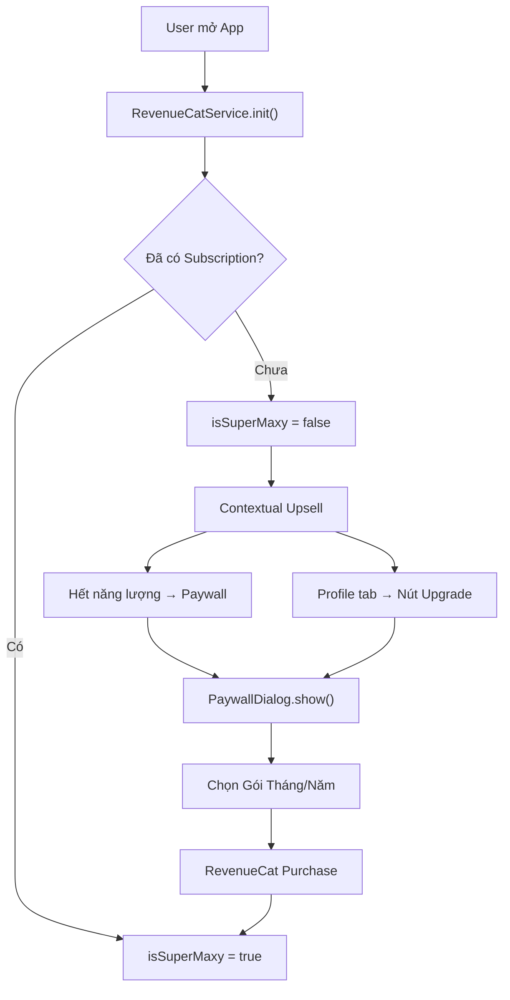

# Walkthrough: Tích Hợp Subscription "Super Maxy VIP"

## Tổng Quan

Tích hợp hệ thống Subscription cho app học tiếng Anh, sử dụng **RevenueCat** làm backend thanh toán. Gói VIP duy nhất "Super Maxy" mang lại 4 quyền lợi chính: vô hạn năng lượng, không quảng cáo, mở khóa toàn bộ bài học, và nhân đôi sao thưởng.

---

## Các File Đã Thay Đổi

### Tầng Service (Core)

| File | Thay đổi |
|------|----------|
| [revenuecat_service.dart](file:///Users/devsang/Developer/App%20Learn%20English/lib/core/services/revenuecat_service.dart) | **[NEW]** Dịch vụ quản lý RevenueCat SDK: init, fetch offerings, purchase, restore, listener |
| [progress_service.dart](file:///Users/devsang/Developer/App%20Learn%20English/lib/core/services/progress_service.dart) | Thêm VIP check vào `deductEnergy()`, `saveLessonResult()` (x2 sao), `isTopicUnlocked()` |
| [main.dart](file:///Users/devsang/Developer/App%20Learn%20English/lib/main.dart) | Inject `RevenueCatService` vào chuỗi khởi tạo app |

### Tầng Controller (Game Logic)

| File | Thay đổi |
|------|----------|
| [learning_controller.dart](file:///Users/devsang/Developer/App%20Learn%20English/lib/presentation/controllers/learning_controller.dart) | Bypass quảng cáo interstitial nếu VIP |
| [memory_match_controller.dart](file:///Users/devsang/Developer/App%20Learn%20English/lib/presentation/controllers/memory_match_controller.dart) | Bypass quảng cáo interstitial nếu VIP |
| [listen_find_controller.dart](file:///Users/devsang/Developer/App%20Learn%20English/lib/presentation/controllers/listen_find_controller.dart) | Bypass quảng cáo interstitial nếu VIP |

### Tầng UI (Paywall & Upsell)

| File | Thay đổi |
|------|----------|
| [paywall_dialog.dart](file:///Users/devsang/Developer/App%20Learn%20English/lib/presentation/widgets/paywall_dialog.dart) | **[NEW]** Màn hình chốt đơn VIP: hiển thị quyền lợi + 2 nút mua (Tháng/Năm) + khôi phục |
| [out_of_energy_dialog.dart](file:///Users/devsang/Developer/App%20Learn%20English/lib/presentation/widgets/out_of_energy_dialog.dart) | Thay nút mock Premium bằng nút mở Paywall thật |
| [profile_achievements_screen.dart](file:///Users/devsang/Developer/App%20Learn%20English/lib/presentation/screens/profile/profile_achievements_screen.dart) | Thêm banner VIP Upgrade / VIP Active |

---

## Luồng Subscription

---

## Verification

- ✅ `dart analyze` — **Không có lỗi**
- ⏳ Test Sandbox — Cần cấu hình API Key thật từ RevenueCat Dashboard

## Bước Tiếp Theo

> [!IMPORTANT]
> Để hoàn tất, bạn cần:
> 1. Tạo tài khoản tại [app.revenuecat.com](https://app.revenuecat.com)
> 2. Thiết lập **Product** trên App Store Connect / Google Play Console
> 3. Copy API Key vào `revenuecat_service.dart` (dòng 8-9)
> 4. Test mua hàng trong môi trường Sandbox
